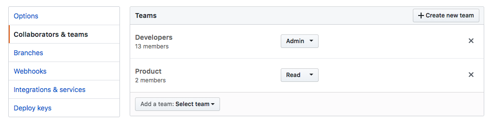
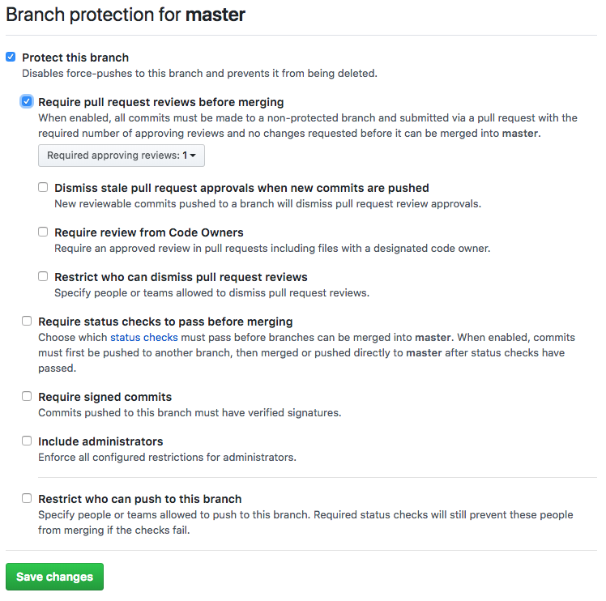

# Creating a Repository

> In order to create a new subservice or module, one has to be aware of multiple issues that have to be addressed. On the one hand, the new repository has to be protected against possible misuse and on the other hand it has to be integrated into our existing workflows. Thus, the following guide shows the do's and dont's of creating a new repository.

## Create a new repository in Github

First of all, create a new repository [here](https://github.com/organizations/StyleLounge/repositories/new).

Select a name that is separated by dashes, add a small description and ensure that it is **private**.

## Update Settings of the new repository

### Collaborators & Teams

Once the repository is created, switch to its settings panel that is available at `https://github.com/StyleLounge/<repository-name>/settings`. Select the tab `Collaborators & Teams` and add the team `Developers` with the permission level `Admin` - you might also want to add `Product` with `read` access. If you set it up correctly, your collaborator settings should look like in the following image.



### Branch Protection

As last administrative step in Github, you need to protect the master branch, so that pull requests require at least one review before they are merged into the master-branch. To do so, switch to the tab `Branches`, ensure that the master branch is your default-branch and eventually select it in the section `Protected Branches`. A new form is opened in which you check the options `Protect this branch` and `Require pull request reviews before merging` - your form should look as follows:



## Generate Baseline Structure

As a next step, return to your terminal and \(if not already happened\) install `yeoman` and the `stylelounge-generator-project`.

```bash
npm i -g yo @style/generator-stylelounge-project
```

Once installed, create a new directory in your workspace and run the generator to create a baseline structure for your repository.

```bash
mkdir <repository-name>
cd <repository-name>
yo @style/stylelounge-project
```

Follow the instructions that are prompting and choose whether your repository should be a module \(imported into other projects\) or an application \(running as a service\).

Finally, sync your changes with Github by running the following commands.

```bash
git init
git add --all
git commit -m  "chore: initial version"
git remote add origin https://github.com/StyleLounge/<repository-name>
git push --set-upstream origin master
```

## Add Repository to Wercker

As the repository has to be connected to our CI, you need to connect the project to [Wercker](https://stylelounge.atlassian.net/wiki/spaces/PROD/pages/32276490/Wercker).

To trigger the first build, instead of pushing something new, you can hit a link at the very bottom of the wercker project page where it asks you to create a `wercker.yml` - something like `I already have a wercker.yml. Build now`.

**Remarks:** At this point, sometimes the initial build **fails** to install in the last step; this seems to be a race condition in the wercker pipeline. If this is the case, just restart the first pipeline step \(`build`\).

